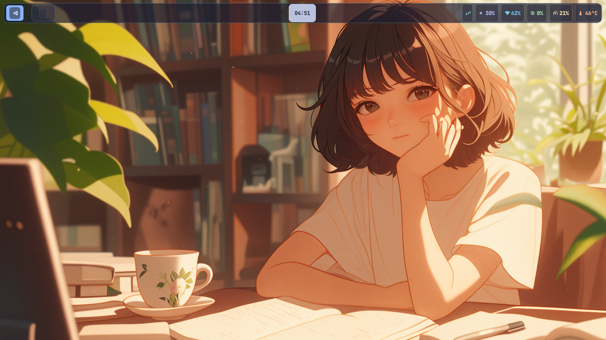
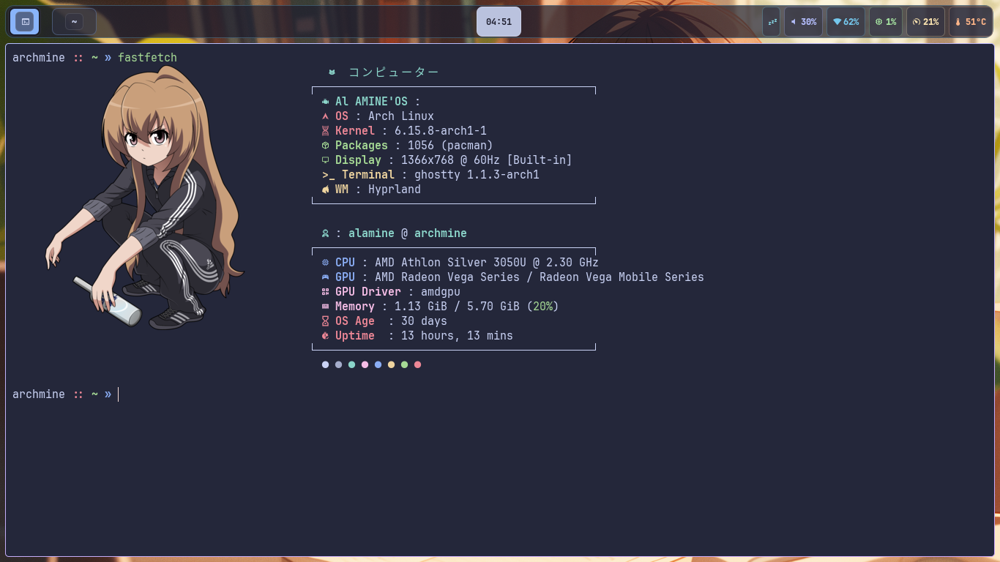
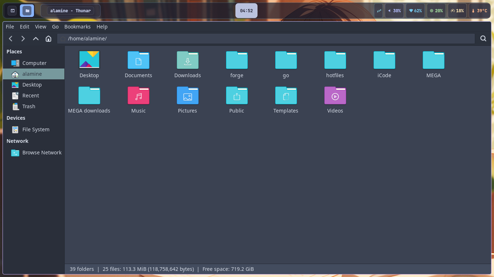
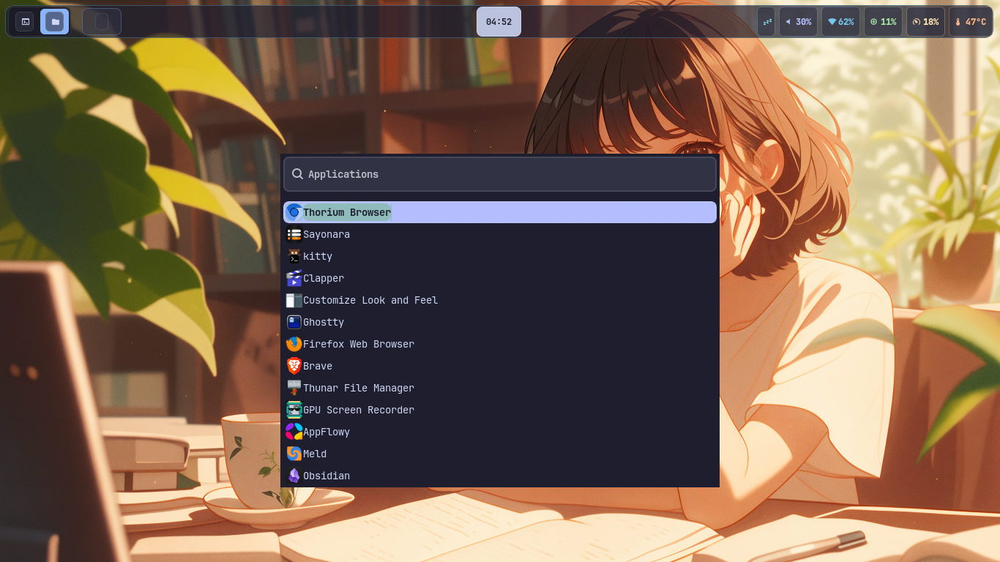
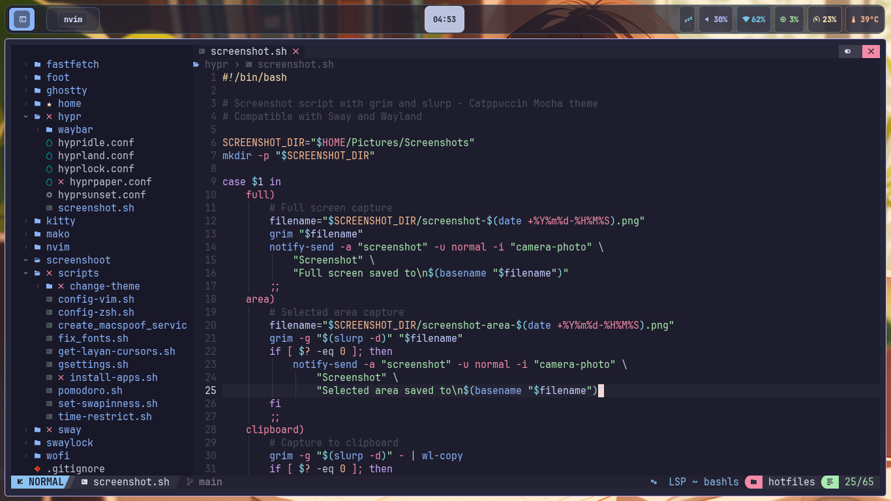

<div align="center">
    <h1>【 hotfiles 】</h1>
    <h3></h3>
</div>


<div align="center"> 


</div>


This repository contains my personal Linux configuration for Hyprland and Sway. My goal for this configuration is to provide a modern, beautiful, productive, and simple workflow with extensive theme support, making it very easy to configure your own themes.

I've created a script (`install.sh`) that allows for a quick installation of my work environment, as well as backup and restoration capabilities.

## 📸 Screenshots

<div align="center">

### Desktop Overview


### Terminal


### File Manager


### Application Launcher


### Neovim


</div>

## ✨ Features

*   **Modern Workflow**: Designed for a smooth and efficient user experience.
*   **Extensive Theming**: Easy to switch between themes and add new ones.
*   **Automated Setup**: Simple installation, backup, and restore processes.
*   **Consistent Keybindings**: Unified keybindings for both Hyprland and Sway.

## 🎨 Supported Themes

Currently supported themes:
*   `catppuccin-macchiato` (dark)
*   `rose-pine-dawn` (light)

Themes under development:
*   `catppuccin-mocha`
*   `catppuccin-latte`
*   `catppuccin-frappe`
*   `rose-pine-moon` (dark)
*   `gruvbox-dark`
*   `gruvbox-light`
*   `nord`

## 🚀 Covered Applications

This configuration covers the following applications:
*   **Terminal Emulators**: `foot`, `ghostty`
*   **Bar**: `waybar`
*   **Notifications**: `mako`
*   **Application Launcher**: `wofi`
*   **Text Editors**: `nvim`, `vim`
*   **System Info**: `fastfetch`
*   **utilitary**: `yazi`, `onefetch`, `hyprlock`, `swaylock-effects`, `slurp`

yazi : yazi is a simple and fast terminal file manager.
onefetch : command-line git information tool.
hyprlock : hyprland lockscreen .
swaylock-effects : a simple lockscreen for sway.
slurp :  simple screenshot tool by selecting a region.


## ⚙️ Installation

To get started, clone the repository and run the installation script:

```bash
git clone --depth 1 https://github.com/alaminedione/hotfiles.git
cd hotfiles
./install.sh
```

For a detailed explanation of the `install.sh` script, its options, and how to use it, please refer to the  [Installation Guide ](GUIDE_INSTALLATION_EN.md).

## ⌨️ Keybindings

Keybindings are consistent across both Sway and Hyprland. The main modifier key (`$mod`) is the **Super key** (Windows key).

Here's a summary of the most common keybindings:

### General

| Keybinding             | Action                                  |
| :--------------------- | :-------------------------------------- |
| `$mod + Return`        | Launch Terminal (`ghostty`)             |
| `$mod + q`             | Kill active window                      |
| `$mod + d`             | Launch application menu (`wofi drun`)   |
| `$mod + x`             | Power menu (`wofi power`)               |
| `$mod + c`             | Launch Calculator (`galculator`)        |
| `$mod + v`             | Clipboard history (`clipman pick`)      |
| `$mod + b`             | Toggle Waybar                           |
| `$mod + Ctrl + l`      | Lock screen (`hyprlock` / `swaylock`)   |

### Window Management

| Keybinding             | Action                                  |
| :--------------------- | :-------------------------------------- |
| `$mod + Left/Right/Up/Down` | Move focus to adjacent window           |
| `$mod + space`         | Toggle floating mode for active window  |
| `$mod + Tab`           | Switch to previously focused workspace  |

### Workspaces

| Keybinding             | Action                                  |
| :--------------------- | :-------------------------------------- |
| `$mod + [1-0]`         | Switch to workspace `[1-10]`            |
| `$mod + Shift + [1-0]` | Move active window to workspace `[1-10]`|

### Screenshots

| Keybinding             | Action                                  |
| :--------------------- | :-------------------------------------- |
| `Print`                | Full screenshot                         |
| `$mod + s`             | Area screenshot                         |


For a complete and up-to-date list of keybindings, please refer to the configuration files:
*   `~/.config/hypr/hyprland.conf`
*   `~/.config/sway/config`

## 💾 Backup and Restore

This repository includes a robust backup and restore system. The `install.sh` script automatically creates a backup of your existing configurations before installation.

To manage your backups and restore previous configurations, use the `restore.sh` script:

```bash
./restore.sh # Interactive menu to select a backup
```

You can also restore a specific backup directly using its timestamp:

```bash
./restore.sh <timestamp> # e.g., ./restore.sh 20240127-143052
```

For more detailed information on backup and restoration, including listing, viewing details, deleting, and cleaning up old backups, please refer to the dedicated guide: [Backup and Restore Guide ](README-backup-restore-EN.md).

## 🎨 How to Change Themes

Themes can be changed using the scripts located in `scripts/change-theme/`. For example, to apply the `catppuccin-mocha` theme:

```bash
./scripts/change-theme/set-mocha.sh
```

To apply the `rose-pine-dawn` theme:

```bash
./scripts/change-theme/set-rose-pine-dawn.sh
```

After changing a theme, it's recommended to restart your applications or session to see all changes applied.

## ➕ How to Add a New Theme

Adding a new theme involves creating theme-specific configuration files for each application and then creating a shell script to apply these theme files.

Here's a step-by-step guide:

### Step 1: Create Theme Files for Each Application

For each application, you'll need to create a new theme file in its respective theme directory. The naming convention should be consistent (e.g., `your-new-theme.ini`, `your-new-theme.conf`, `your-new-theme.css`).

*   **foot**: Create a `.ini` file in `foot/themes/` (e.g., `foot/themes/your-new-theme.ini`).
*   **kitty**: Create a `.conf` file in `kitty/themes/` (e.g., `kitty/themes/your-new-theme.conf`).
*   **wofi**: Create a `.css` file in `wofi/` (e.g., `wofi/your-new-theme.css`).
*   **waybar (Hyprland)**: Create a `.css` file in `hypr/waybar/` (e.g., `hypr/waybar/your-new-theme.css`).
*   **waybar (Sway)**: Create a `.css` file in `sway/waybar/` (e.g., `waybar/your-new-theme.css`).
*   **mako**: Create a configuration file in `mako/` (e.g., `mako/your-new-theme`).
*   **sway**: Create a theme directory in `sway/themes/` containing your Sway-specific configurations (e.g., `sway/themes/your-new-theme/config`).
*   **ghostty**: ghostty support already a lot of themes `ghostty +list-themes`.
*   **vim**: You'll need to install a theme with vimp-plug.
*   **nvim**: NvChad support a lot of themes `<leader>th` in nvim.to see all themes.
*   **gsettings**: You'll need to install a theme (cursors, icons, themes).
*   **kvantum**: open Kvantum and add your theme. 
*   **wallpaper**: put your wallpaper in `~/.wallpaper/` .

### Step 2: Create a Theme Application Script

Create a new shell script in `scripts/change-theme/` (e.g., `scripts/change-theme/set-your-new-theme.sh`). This script will be responsible for applying your new theme to all relevant applications.

Here's a template you can adapt:

```bash
#!/bin/bash

# foot
sed -i "s|^include=~/.config/foot/themes/.*|include=~/.config/foot/themes/your-new-theme.ini|" ~/.config/foot/foot.ini

# kitty
echo "include themes/your-new-theme.conf" > ~/.config/kitty/colors.conf

# wofi
cp ~/.config/wofi/your-new-theme.css ~/.config/wofi/style.css

# waybar sway
cp ~/.config/sway/waybar/your-new-theme.css ~/.config/sway/waybar/style.css

# waybar hyprland
cp ~/.config/hypr/waybar/your-new-theme.css ~/.config/hypr/waybar/style.css

# vim
sed -i "s|^set background=light|set background=dark|" ~/.vimrc # Adjust 'dark' or 'light' as needed
sed -i "s|^colorscheme .*|colorscheme your_vim_colorscheme|" ~/.vimrc

# nvim
sed -i "s|theme = .*|theme = \"your_nvim_theme\",|" ~/.config/nvim/lua/chadrc.lua
nvim --headless +'lua require("base46").load_all_highlights()' +qa # Reload nvim theme

# sway
sed -i "s|^include=./themes/.*|include=./themes/your-new-theme|" ~/.config/sway/config

# mako
cp ~/.config/mako/your-new-theme ~/.config/mako/config

# ghostty
sed -i "s|theme=.*|theme=your-new-theme|" ~/.config/ghostty/config

# gsettings (adjust values as per your theme's light/dark preference and fonts)
gsettings set org.gnome.desktop.interface icon-theme 'YourIconTheme'
gsettings set org.gnome.desktop.interface color-scheme 'prefer-dark' # or 'prefer-light'
gsettings set org.gnome.desktop.interface gtk-theme "YourGtkTheme"
gsettings set org.gnome.desktop.wm.preferences theme "YourGtkTheme"
gsettings set org.gnome.desktop.interface font-name 'YourFontName 10.4'
gsettings set org.gnome.desktop.interface document-font-name 'YourFontName 10.4'
gsettings set org.gnome.desktop.interface monospace-font-name 'YourMonoFontName 10.4'
gsettings set org.gnome.desktop.interface cursor-theme 'YourCursorTheme'

# GTK settings for dark/light preference, make sure that you have a settings.ini file in your ~/.config/gtk-3.0/ and ~/.config/gtk-4.0/ folders
# if your're using a light theme do this :
echo -e "[Settings] \n gtk-application-prefer-dark-theme=1" > ~/.config/gtk-3.0/settings.ini  
# if your're using a dark theme do this instead:
echo "" >~/.config/gtk-3.0/settings.ini 
echo "" >~/.config/gtk-4.0/settings.ini

# kvantum
sed -i "s|theme=.*|theme=YourKvantumTheme|" ~/.config/Kvantum/kvantum.kvconfig

# Wallpaper
sed -i "s|output * bg .*|output * bg ~/.wallpaper/your-wallpaper fill|" ~/.config/sway/config
sed -i -e "s|preload = ~/.wallpaper/.*|preload = ~/.wallpaper/your-wallpaper|" -e "s|wallpaper = ,~/.wallpaper/.*|wallpaper = ,~/.wallpaper/your-wallpaper|" ~/.config/hypr/hyprpaper.conf

echo "Your New Theme applied successfully!"
echo "Restart your applications to see the changes."
```

Remember to make the new script executable:

```bash
chmod +x scripts/change-theme/set-your-new-theme.sh
```

### Step 3: Test Your New Theme

Run your newly created script:

```bash
./scripts/change-theme/set-your-new-theme.sh
```

Then, restart your applications (or your session) to see the changes take effect.


## ⚠️ Important Notes

*   **Restart Required**: After installation or restoration, it's recommended to restart your session to apply all changes.
*   **Permissions**: Ensure that `install.sh` and `restore.sh` are executable (`chmod +x install.sh restore.sh`).

## 🤝 Support

For any issues or suggestions, please open an issue on the project's GitHub repository.
